# Stanford 2023 - Memoroji
Memory card game app made following Stanford University's course CS193p (Developing Applications for iOS using SwiftUI) - https://cs193p.sites.stanford.edu/2023
 
 
Evolved freely by myself to add several features: 
- App Sound
- Cards color
- Custom deck & Multiple default themed decks
- Launch Screen
- Scoreboard & Scorecard

##

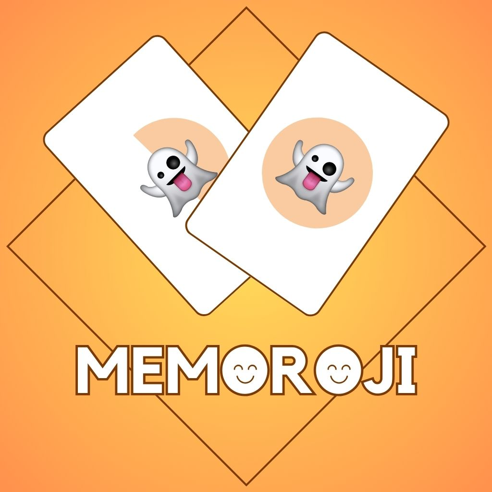

## This app features
- MVVM architecture
- Model for game conforming to Equatable, Identifiable and CustomDebugStringConvertible
- Logic implemented in Model for game: Creation of game, shuffle of cards, chosing a card and comparing it with the next one chosen, score for the game
- Model for card decks
- Model for scorecard
- Model for sounds of the app
- ViewModel uses Combine to dismiss temporary confirmations shown in View
---
- Animations (also using @Namespace to synchronize view animation from undealt cards to dealt)
- AVKit (Sound player)
- Transitions
- MatchedGeometryEffect
- UserDefaults
---
- Options menu to activate or mute sounds, to create or edit a custom deck, to set the card color, to select the deck to play, to see the scoreboard and to see the app info
- Button to start / restart the game
- ConfirmationDialog when game ends, user can play again, save the score (if it's a top score) or quit the game
- DeckEditor view to create a custom deck, edit the existing one or remove it
- Scoreform view to save the score
- Scoreboard view with highest ten scores & reset possibility
- Credits view with project's info
- Animated Launch view
---
- Languages: Localized in Catalan, English and Spanish
- Sounds played when cards are dealt and game finishes
- Custom Colors Gold, Silver and UltraViolet (see reference below)
- Custom App Icon made with Canva
---
**Components**
- AnimatedactionButton: Button with its actions animated
- AspectVGrid: View resizes its components in a LazyVGrid according to how many of them are created at the begining of the game, using GeometryReader
- ConfirmationRectangle: View shown to user after saving their score, reseting the scoreboard or removing the custom deck
- DismissXButton: Button that dismisses the view by default, but can execute other actions if needed
- FlyingNumber: The score of each play goes up or down of the card using offset & opacity
- PieShape: A circle that diminishes using TimeInterval, the smaller the less score for the play
- Cardify: Animatable & ViewModifier to give a look & feel of a game card, including a rotation3DEffect
- DelayedAnimafy: ViewModifier to delay views' animation when they appear on the screen

 **Extensions**
- Extension "only" for Array, to return the only element if the array is of one element
- Extension for Color to work with custom colors
- Extension for String to check if a string contains emoji characters

**Color Reference**

| Color             | Hex                                                                |
| ----------------- | ------------------------------------------------------------------ |
| Gold Color |  #B5975B |
| Silver Color |  #CAD3D9 |
| UltraViolet Color |  #CB95F9 |

## License

 [MIT](https://choosealicense.com/licenses/mit/) 

## Screenshots

    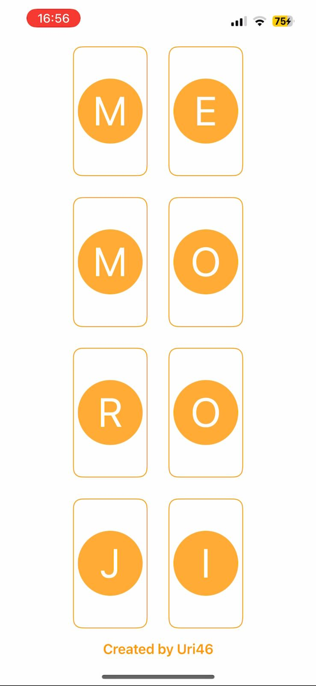
    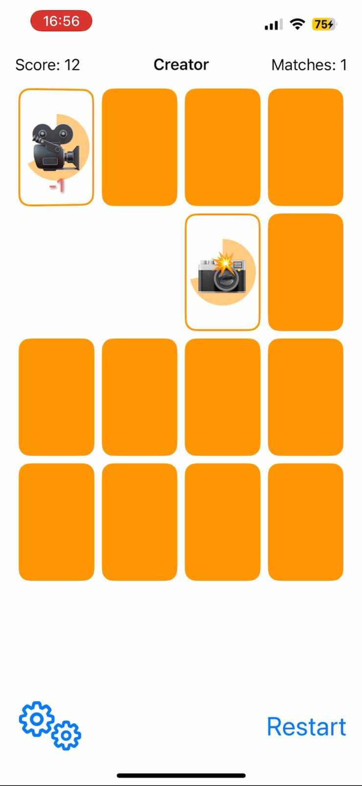
    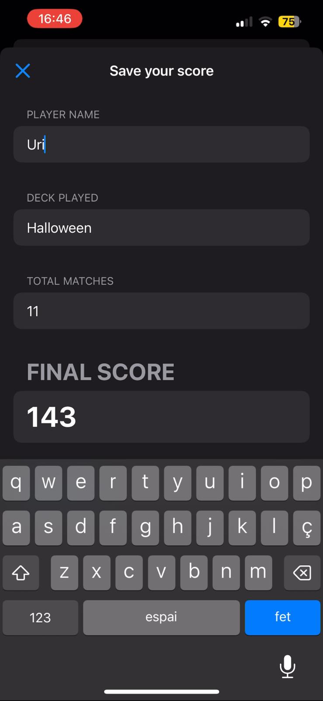
    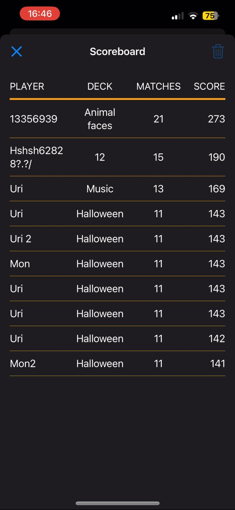

 

    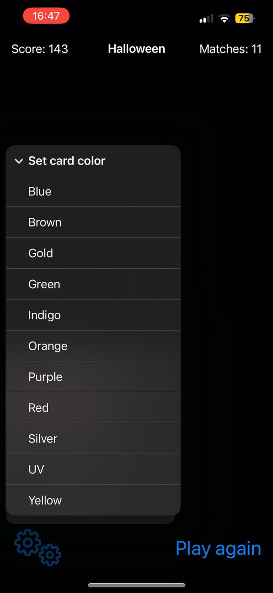
    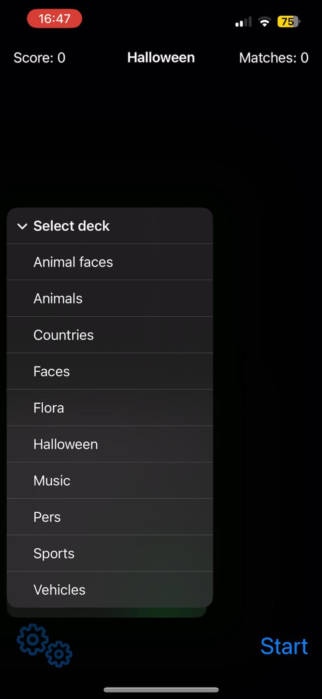
    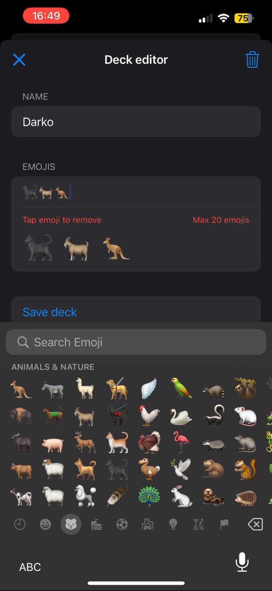
    

 

   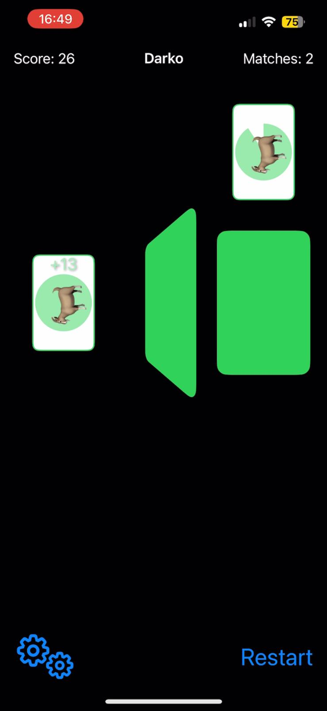
   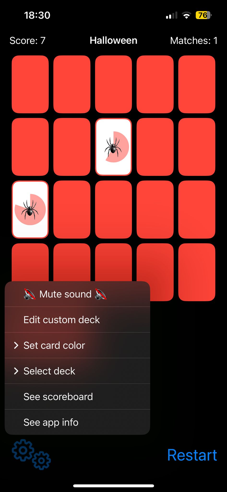
  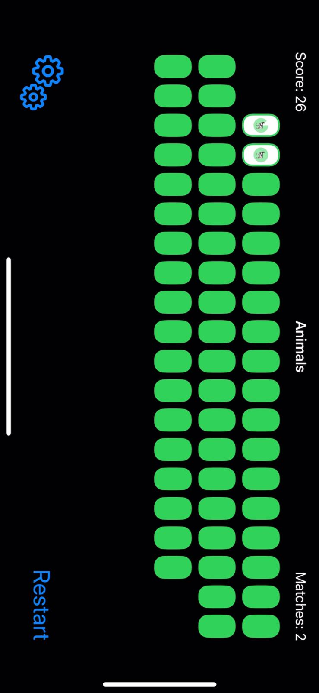

    

## Requirements
- iOS 17.2

